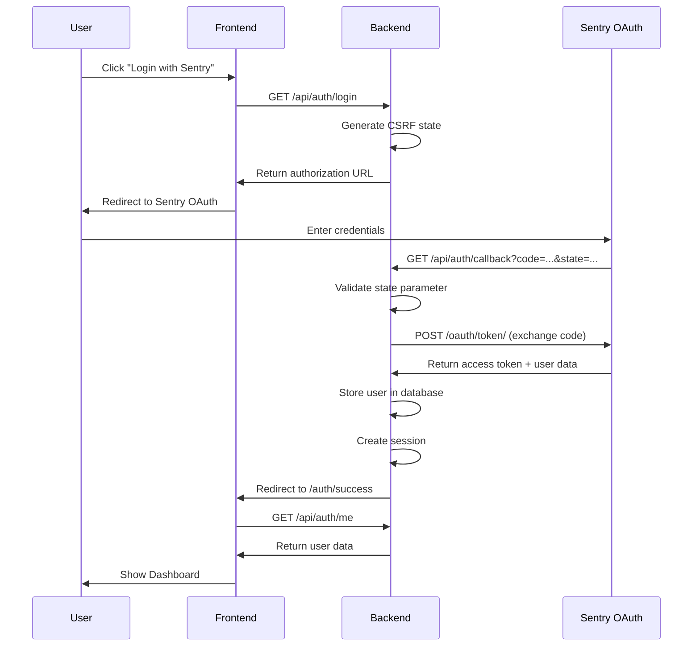
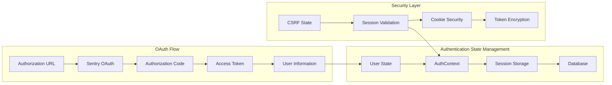
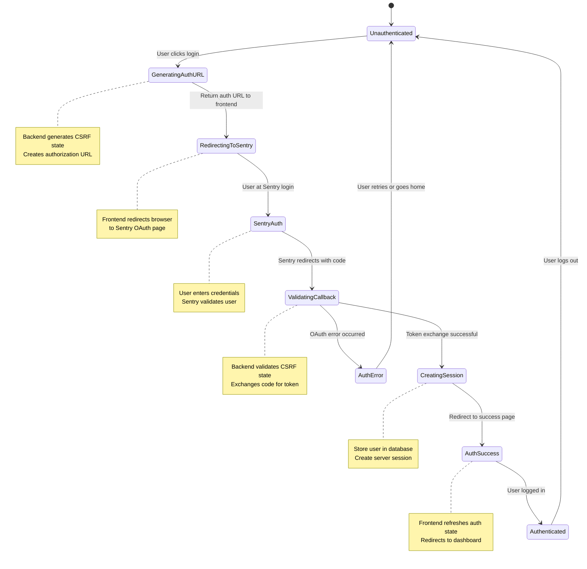
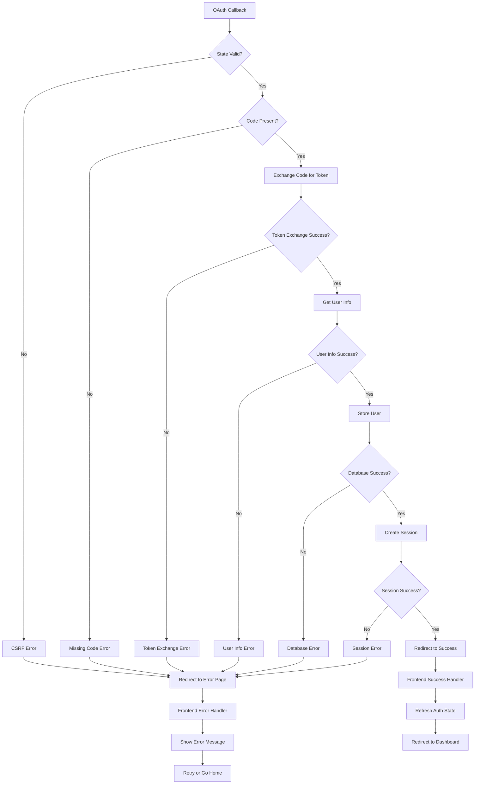
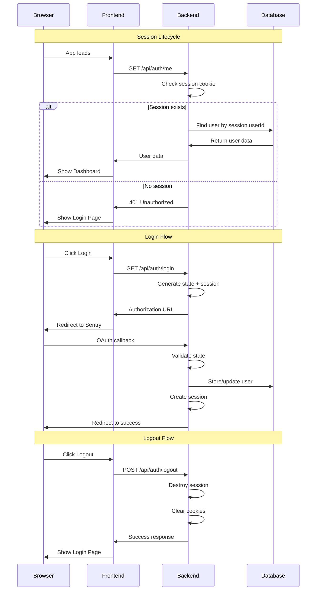

# 🎯 Sentry OAuth Authentication Demo

**A complete, production-ready example of Sentry OAuth 2.0 authentication** with beautiful UI and comprehensive documentation.

This project demonstrates **exactly how to integrate Sentry authentication** into your application, with clear explanations of each step in the OAuth flow.

## 🔐 Authentication Flow Overview

This implementation follows the OAuth 2.0 Authorization Code flow with PKCE (Proof Key for Code Exchange) security. The authentication process involves three main components:

1. **Frontend (React)** - Handles user interaction and authentication state
2. **Backend (Express.js)** - Manages OAuth flow and session storage
3. **Sentry OAuth Provider** - Authenticates users and provides access tokens

## 🔄 Complete Authentication Flow



## 🔐 What This Demonstrates About Sentry Authentication

### **Complete OAuth 2.0 Flow**
- ✅ **Authorization URL Generation** - How to create Sentry OAuth URLs with proper scopes
- ✅ **State Parameter Validation** - CSRF protection for OAuth requests  
- ✅ **Token Exchange** - Converting authorization codes to access tokens
- ✅ **User Data Retrieval** - Getting user information from Sentry's API
- ✅ **Session Management** - Maintaining authenticated user state

### **Sentry-Specific Implementation Details**
- 📋 **Required Scopes**: `org:read project:read team:read member:read event:read` for comprehensive read access
- 🌐 **OAuth Endpoints**: 
  - Authorization: `https://sentry.io/oauth/authorize/`
  - Token Exchange: `https://sentry.io/oauth/token/`
  - User Info: `https://sentry.io/api/0/user/`
- 👤 **User Information**: ID, email, name, username, avatar from Sentry
- 🔧 **Configuration**: OAuth app setup in Sentry organization settings
- 🛡️ **Security**: State validation, secure sessions, token encryption

## ✨ Features

- 🔐 **Production-Ready OAuth 2.0** - Complete Sentry authentication flow
- 🎨 **Beautiful Modern UI** - Professional login page with animations
- 📱 **Responsive Design** - Works perfectly on all devices
- 🗃️ **Simple Storage** - In-memory user storage (easy to understand)
- 🔒 **Secure Sessions** - HTTPOnly cookie-based authentication
- 📝 **Comprehensive Logging** - See exactly what happens during OAuth
- ⚡ **One-Command Setup** - Get running in seconds

## 🚀 Quick Start

1. **Setup Project:**
   ```bash
   npm run setup
   ```

2. **Configure Sentry OAuth:**
   - Edit `server/.env` with your Sentry OAuth credentials
   - Get credentials from your Sentry organization settings

3. **Start Development:**
   ```bash
   npm run dev
   ```

4. **Open Browser:**
   - Frontend: http://localhost:5173
   - Backend: http://localhost:3001

## 📋 Environment Setup

### Required: Sentry OAuth Credentials

Add these to `server/.env`:
```env
SENTRY_OAUTH_CLIENT_ID=your_client_id
SENTRY_OAUTH_CLIENT_SECRET=your_client_secret
SENTRY_OAUTH_REDIRECT_URI=http://localhost:3001/api/auth/callback
SESSION_SECRET=your-random-secret-key
```

## 🛠 Development Commands

```bash
npm run dev          # Start both frontend and backend
npm run dev:backend  # Backend only (port 3001)
npm run dev:frontend # Frontend only (port 5173)
npm run build        # Build for production
npm run start        # Start production mode
```

## 🏗️ Architecture Deep Dive

### Component Diagram

```mermaid
graph TB
    subgraph "Frontend (React)"
        A[App.tsx] --> B[AuthProvider]
        B --> C[LoginPage]
        B --> D[Dashboard]
        B --> E[AuthSuccess]
        B --> F[AuthError]
        
        C --> G[useAuth Hook]
        D --> G
        E --> G
        F --> G
    end
    
    subgraph "Backend (Express.js)"
        H[index.js] --> I[SentryOAuthService]
        H --> J[Database]
        H --> K[Session Management]
        
        I --> L[OAuth Routes]
        L --> M[/api/auth/login]
        L --> N[/api/auth/callback]
        L --> O[/api/auth/me]
        L --> P[/api/auth/logout]
    end
    
    subgraph "External"
        Q[Sentry OAuth Server]
    end
    
    G -.->|HTTP Requests| L
    I -.->|OAuth Flow| Q
```

### Data Flow Architecture



## 📁 Project Structure

```
sentry-auth-example/
├── server/                        # Express.js backend
│   ├── services/
│   │   ├── sentry-oauth.js       # OAuth service implementation
│   │   └── sentry-api.js         # Sentry API integration
│   ├── database.js               # User storage layer
│   ├── index.js                  # Express server & routes
│   └── .env.example             # Environment template
├── sentryauth-frontend/          # React frontend
│   ├── src/
│   │   ├── contexts/
│   │   │   └── AuthContext.tsx   # Global auth state
│   │   ├── components/
│   │   │   ├── LoginPage.tsx     # Login UI
│   │   │   ├── Dashboard.tsx     # Protected dashboard
│   │   │   ├── AuthSuccess.tsx   # OAuth success handler
│   │   │   ├── AuthError.tsx     # OAuth error handler
│   │   │   └── SentryMetrics.tsx # Sentry data display
│   │   ├── App.tsx              # Main app component
│   │   └── main.tsx             # App entry point
│   └── .env.example
└── package.json                 # Root package with scripts
```

## 🔍 Authentication Functions Explained

### Frontend Authentication Functions

#### AuthContext (`/src/contexts/AuthContext.tsx`)

```typescript
// Global authentication state management
const AuthContext = createContext<AuthContextType | undefined>(undefined);

// Main authentication functions:
const checkAuth = async () => {
  // Validates current session with backend
  // Called on app initialization and after OAuth success
  const response = await fetch('/api/auth/me', { credentials: 'include' });
  if (response.ok) setUser(data.user);
};

const login = async () => {
  // Initiates OAuth flow by getting authorization URL
  const response = await fetch('/api/auth/login', { credentials: 'include' });
  const data = await response.json();
  window.location.href = data.authUrl; // Redirect to Sentry
};

const logout = async () => {
  // Destroys server session and clears client state
  await fetch('/api/auth/logout', { method: 'POST', credentials: 'include' });
  setUser(null);
};
```

#### OAuth Callback Handlers

**AuthSuccess Component** (`/src/components/AuthSuccess.tsx`):
```typescript
// Handles successful OAuth redirect from Sentry
useEffect(() => {
  const refreshAndRedirect = async () => {
    await checkAuth(); // Refresh auth state
    setTimeout(() => window.location.href = '/', 1000); // Redirect to dashboard
  };
  refreshAndRedirect();
}, []);
```

**AuthError Component** (`/src/components/AuthError.tsx`):
```typescript
// Handles OAuth errors with retry functionality
const urlParams = new URLSearchParams(window.location.search);
const errorMessage = urlParams.get('message'); // Extract error from URL
```

### Backend Authentication Functions

#### OAuth Service (`/server/services/sentry-oauth.js`)

```javascript
class SentryOAuthService {
  // Step 1: Generate authorization URL with CSRF protection
  getAuthorizationUrl(state) {
    const params = new URLSearchParams({
      response_type: 'code',
      client_id: this.config.clientId,
      redirect_uri: this.config.redirectUri,
      scope: 'org:read project:read team:read member:read event:read', // Sentry read scopes
      state: state // CSRF protection
    });
    return `${this.config.baseUrl}/oauth/authorize/?${params.toString()}`;
  }

  // Step 2: Exchange authorization code for access token
  async exchangeCodeForToken(code) {
    const response = await fetch(`${this.config.baseUrl}/oauth/token/`, {
      method: 'POST',
      headers: { 'Content-Type': 'application/x-www-form-urlencoded' },
      body: new URLSearchParams({
        grant_type: 'authorization_code',
        client_id: this.config.clientId,
        client_secret: this.config.clientSecret,
        code: code,
        redirect_uri: this.config.redirectUri
      })
    });
    return response.json();
  }

  // Step 3: Get user information from Sentry API
  async getUserInfo(accessToken) {
    // Try multiple endpoints for user data
    const endpoints = [
      '/oauth/userinfo', '/api/0/user/', '/api/0/users/me/'
    ];
    
    for (const endpoint of endpoints) {
      const response = await fetch(`${this.baseUrl}${endpoint}`, {
        headers: { 'Authorization': `Bearer ${accessToken}` }
      });
      if (response.ok) return response.json();
    }
  }
}
```

#### Express.js Route Handlers (`/server/index.js`)

```javascript
// Middleware: Require authentication for protected routes
const requireAuth = (req, res, next) => {
  if (req.session && req.session.userId) {
    next();
  } else {
    res.status(401).json({ error: 'Authentication required' });
  }
};

// Route: Initiate OAuth flow
app.get('/api/auth/login', (req, res) => {
  const state = uuidv4(); // Generate CSRF token
  req.session.oauthState = state; // Store in session
  const authUrl = sentryOAuthService.getAuthorizationUrl(state);
  res.json({ authUrl });
});

// Route: Handle OAuth callback
app.get('/api/auth/callback', async (req, res) => {
  const { code, state } = req.query;
  
  // Validate CSRF state
  if (state !== req.session.oauthState) {
    return res.status(400).json({ error: 'Invalid state parameter' });
  }
  
  // Complete OAuth flow
  const { user, accessToken } = await sentryOAuthService.completeOAuthFlow(code);
  
  // Store user and create session
  const dbUser = await database.createUser(user, accessToken);
  req.session.userId = dbUser.id;
  
  // Redirect to success page
  res.redirect(`${frontendUrl}/auth/success`);
});

// Route: Get current user
app.get('/api/auth/me', requireAuth, async (req, res) => {
  const user = await database.findUserById(req.session.userId);
  res.json({ user: user });
});

// Route: Logout
app.post('/api/auth/logout', (req, res) => {
  req.session.destroy((err) => {
    if (err) return res.status(500).json({ error: 'Failed to logout' });
    res.clearCookie('connect.sid');
    res.json({ message: 'Logged out successfully' });
  });
});
```

#### Database Functions (`/server/database.js`)

```javascript
class SimpleUserStore {
  // Create new user from Sentry OAuth data
  createUser(sentryUser, accessToken) {
    const user = {
      id: this.nextId++,
      sentry_id: sentryUser.id,
      email: sentryUser.email,
      name: sentryUser.name,
      username: sentryUser.username,
      avatar_url: sentryUser.avatar,
      access_token: accessToken, // Store for API calls
      created_at: new Date().toISOString(),
      updated_at: new Date().toISOString()
    };
    
    // Store in multiple indexes for fast lookup
    this.users.set(user.id, user);
    this.usersBySentryId.set(user.sentry_id, user);
    this.usersByEmail.set(user.email, user);
    
    return user;
  }

  // Update existing user on subsequent logins
  updateUser(sentryUser, accessToken) {
    const existingUser = this.usersBySentryId.get(sentryUser.id);
    const updatedUser = {
      ...existingUser,
      email: sentryUser.email, // Update with fresh data
      name: sentryUser.name,
      username: sentryUser.username,
      avatar_url: sentryUser.avatar,
      access_token: accessToken, // Refresh token
      updated_at: new Date().toISOString()
    };
    
    // Update all indexes
    this.users.set(updatedUser.id, updatedUser);
    this.usersBySentryId.set(updatedUser.sentry_id, updatedUser);
    
    return updatedUser;
  }
}
```

## 🔐 Security Features

### Authentication Security
- **OAuth 2.0 Authorization Code Flow** - Industry standard secure authentication
- **CSRF Protection** - State parameter validation prevents cross-site request forgery
- **Secure Session Management** - HTTPOnly cookies with encryption
- **Token Storage** - Access tokens encrypted and stored securely

### Network Security  
- **CORS Configuration** - Proper cross-origin resource sharing setup
- **HTTPS Ready** - Production configuration for secure connections
- **Secure Headers** - Security headers for production deployment

### Data Protection
- **SQL Injection Prevention** - Parameterized queries and input validation
- **Session Encryption** - Sessions encrypted with secure secret keys
- **Sensitive Data Handling** - Access tokens never exposed to frontend
- **Comprehensive Error Handling** - Secure error messages without data leakage

## 🎯 Step-by-Step Implementation Guide

### 1. Setting Up Sentry OAuth Application

1. Go to your Sentry organization settings
2. Navigate to **Developer Settings** → **OAuth Applications**
3. Click **Create New Application**
4. Configure:
   - **Name**: Your app name
   - **Homepage URL**: `http://localhost:5173` (development)
   - **Authorization callback URL**: `http://localhost:3001/api/auth/callback`
5. Save the `Client ID` and `Client Secret`

### 2. Environment Configuration

Create `server/.env`:
```env
SENTRY_OAUTH_CLIENT_ID=your_actual_client_id
SENTRY_OAUTH_CLIENT_SECRET=your_actual_client_secret
SENTRY_OAUTH_REDIRECT_URI=http://localhost:3001/api/auth/callback
SESSION_SECRET=your-super-secret-session-key-at-least-32-chars
SENTRY_BASE_URL=https://sentry.io
```

### 3. OAuth Flow Step-by-Step



### 4. Error Handling Flow



### 5. Session Management Flow



## 🔧 Production Deployment Checklist

### Environment Variables
- [ ] Use strong, random `SESSION_SECRET` (32+ characters)
- [ ] Set `NODE_ENV=production`
- [ ] Use HTTPS URLs for redirect URIs
- [ ] Configure proper CORS origins

### Security Headers
```javascript
app.use(helmet({
  contentSecurityPolicy: {
    directives: {
      defaultSrc: ["'self'"],
      scriptSrc: ["'self'", "'unsafe-inline'"],
      styleSrc: ["'self'", "'unsafe-inline'"],
      imgSrc: ["'self'", "data:", "https:"],
    },
  },
}));
```

### Database Migration
- [ ] Replace in-memory storage with persistent database
- [ ] Implement proper user schema with indexes
- [ ] Add database connection pooling
- [ ] Set up database backups

### Monitoring & Logging
- [ ] Add structured logging with Winston or Bunyan
- [ ] Implement health check endpoints
- [ ] Set up error tracking (ironically, with Sentry!)
- [ ] Add performance monitoring

## 🤝 Contributing

1. Fork the repository
2. Create your feature branch (`git checkout -b feature/amazing-feature`)
3. Commit your changes (`git commit -m 'Add amazing feature'`)
4. Push to the branch (`git push origin feature/amazing-feature`)
5. Open a Pull Request

## 📄 License

ISC License - see LICENSE file for details

---

## 📚 Additional Resources

- [Sentry OAuth Documentation](https://docs.sentry.io/api/auth/)
- [OAuth 2.0 RFC](https://tools.ietf.org/html/rfc6749)
- [Express.js Session Documentation](https://github.com/expressjs/session)
- [React Context API](https://react.dev/reference/react/useContext)